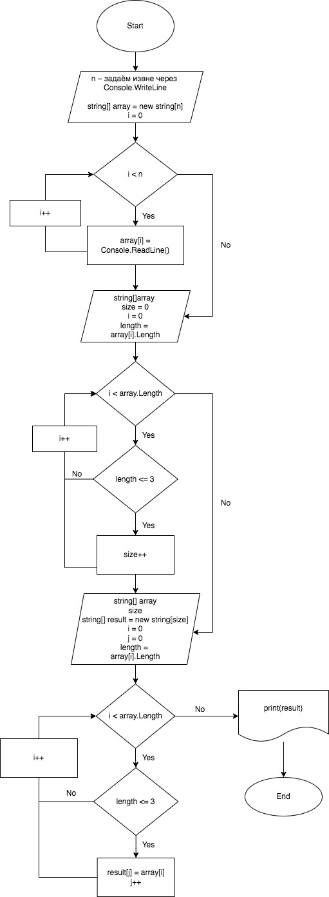

# Описание решения программы

## Шаг 1. Создание и заполнение массива

Просим пользователя задать размер массива **с помощью команды Console.WriteLine** и конвертируем в int **с помощью Convert.ToInt32.**

Далее инициализируем новый **массив array типа string** с количеством переменных равных n. 
Просим пользователя **поэлементно заполнить массив** (c помощью Console.WriteLine) до тех пор, пока i (количество элементов) менее n. 

**_Выводим изначальный заполненный массив с помощью команды string.Join._**

## Шаг 2. Определение **размера** итогового массива

**Создаём метод SizeArray**, принимая на вход массив array. 
Инициализируем **size через int** и приравниваем изначально к 0.
Также инициализируем **переменную length, которая равна длинне элемента i** из массива array. 

Далее поэлементно перебираем массив array и **как только встречаем элемент с количеством символов меньшим либо равным 3-м** => увеличиваем size на +1. Если количество символов элемента больше 3-ёх – пропускаем его. 

**_Выводим через Console.WriteLine количество элементов конечного массива (size), взяв на вход наш ранее заполненный массив array._**

## Шаг 3. Определение итогового массива

**Создаём метод NewArray**, принимая на вход массив array и величину нового массива size.
Инициализируем **новый результирующий массив result** размером size. И также инициализируем **переменную length, которая равна длинне элемента i** из массива array. 

Снова проходим по всем элементам (i) массива array и в тех случаях, **когда количество символов элемента меньше либо равно 3 => записываем его в новый массив result j-тым элементом** (каждый раз увеличивая j на +1). Если количество символов элемента больше 3-ёх – пропускаем его. 

**_Выводим итоговый заполненный массив с помощью команды string.Join_**.

